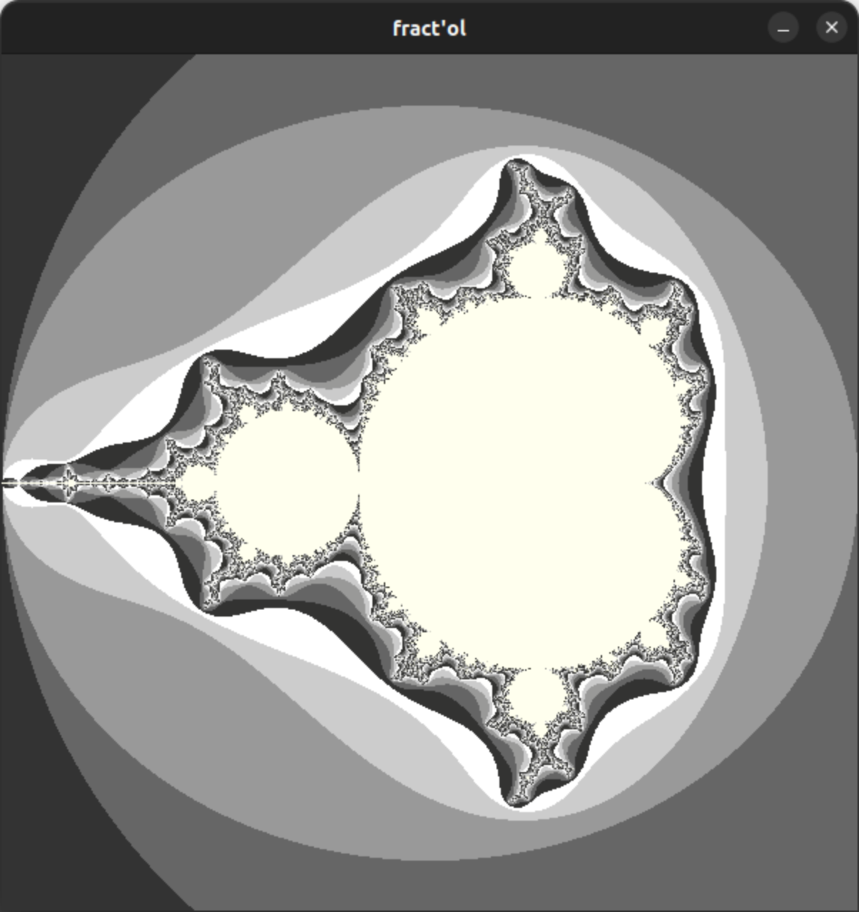
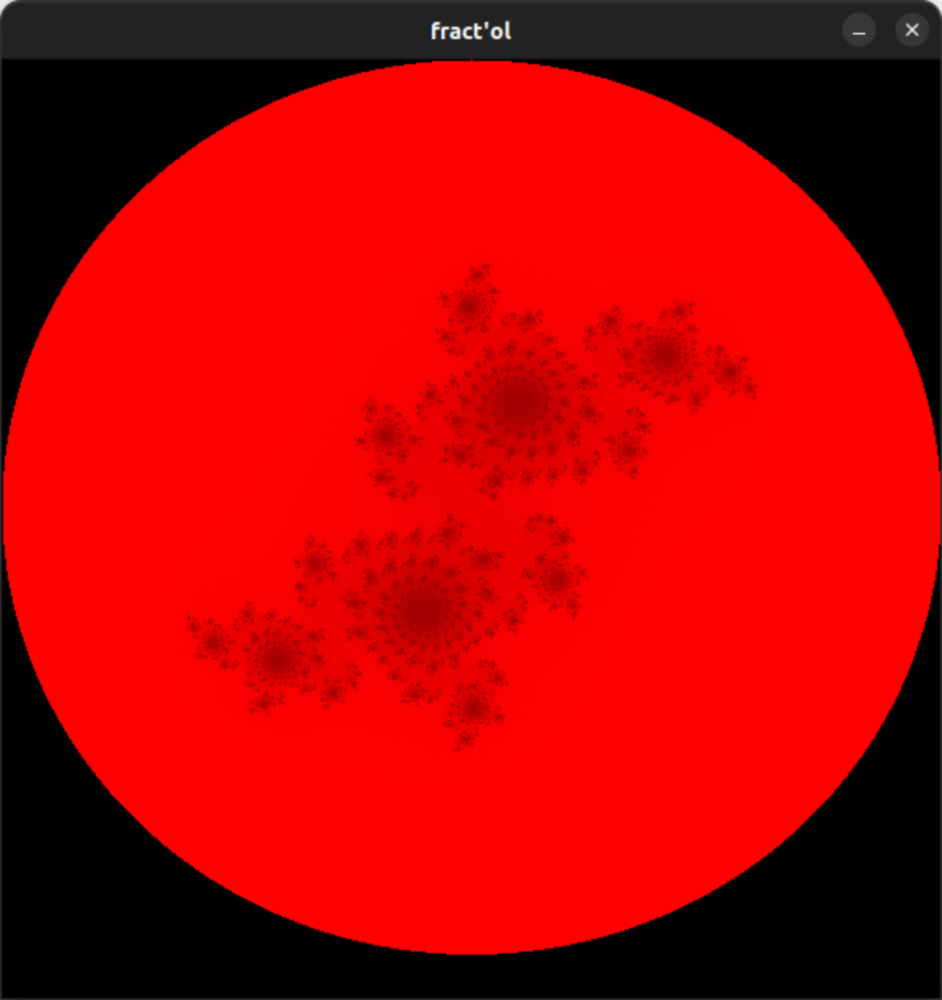
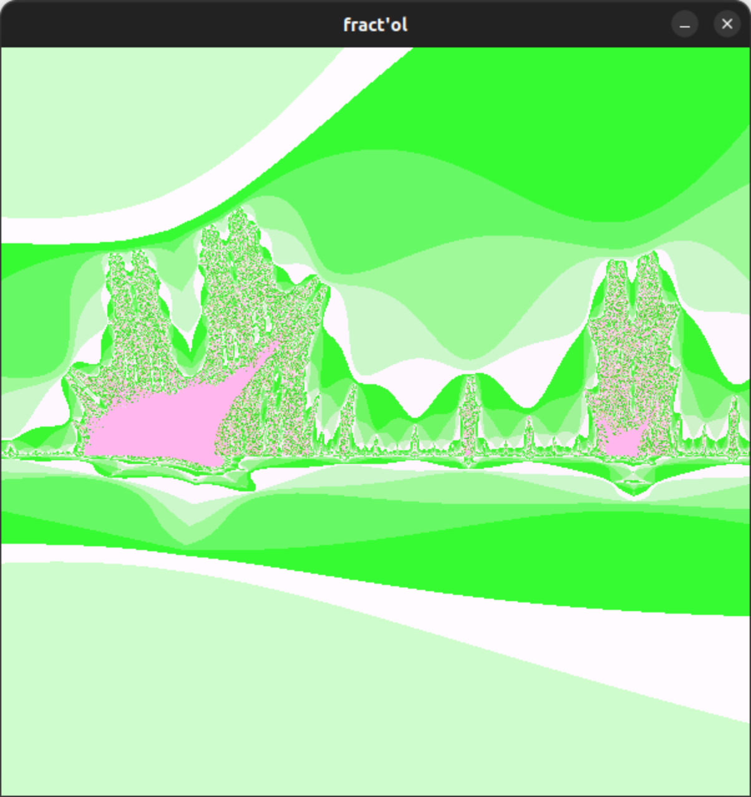

# Fractal renderer

## Current status
-- Completed --

## Description

This is a single threaded application written in C. It generates below listed
fractals using a graphics library Minilibx, which provides a beginner-friendly
C API to interact with the X11 system.
Following fractals are available:
- Mandelbrot set
- Julia set
- burning ship set

## Installation

```bash
# move into necessary directory: either Linux or MacOS platform
cd linux_version && make
```

## Usage

- Start the program by choosing the type of fractal ```-[m/j/b]``` as a parameter.

```bash
./fractol -m
```

- To move use ```W, A, S, D```

- To zoom in / out

```
use mouse wheel or arrow keys up / down
```

- To change colors and sets, press ```ENTER``` and ```SPACE``` respectively.

- To reset image press ```R```.

## Examples

Mandelbrot set
<br>


Julia set
<br>


Burning ship
<br>

